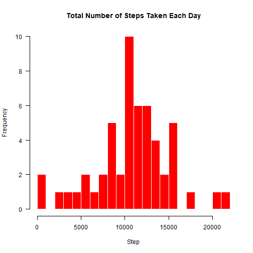
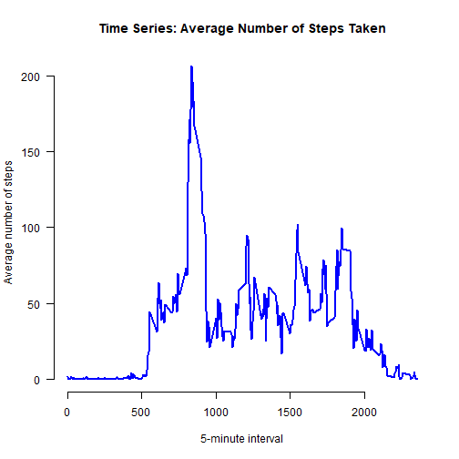
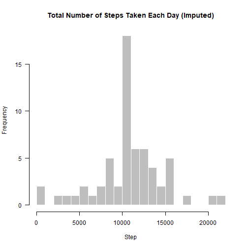
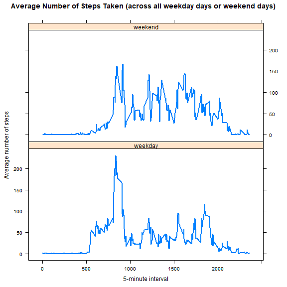

title: "Assignment 1 for Reproducible Research"
---


# Loading the data and the processing it.

1. **Loading the data**

```r
activity <- read.csv("activity.csv")
str(activity)
```

```
## 'data.frame':	17568 obs. of  3 variables:
##  $ steps   : int  NA NA NA NA NA NA NA NA NA NA ...
##  $ date    : chr  "2012-10-01" "2012-10-01" "2012-10-01" "2012-10-01" ...
##  $ interval: int  0 5 10 15 20 25 30 35 40 45 ...
```

2. **Processing the data**

```r
activity$date <- as.Date(activity$date, format = "%Y-%m-%d")
```

# Mean total number of steps taken per day not taking into account the missing values

1. **Calculate the total number of steps taken per day.**

```r
# "totalno_steps" is the variable used to store total number of steps taken per day
totalno_steps <- aggregate(steps ~ date, data = activity, sum, na.rm = TRUE)
head(totalno_steps)
```

```
##         date steps
## 1 2012-10-02   126
## 2 2012-10-03 11352
## 3 2012-10-04 12116
## 4 2012-10-05 13294
## 5 2012-10-06 15420
## 6 2012-10-07 11015
```

2. **Making a histogram of the total number of steps taken each day.**


```r
par(mfrow = c(1, 1))
# Use base graphic system
hist(totalno_steps$steps, breaks = 20, 
     main = "Total Number of Steps Taken Each Day",
     col = "red", border = "white", xlab = "Step", axes = FALSE)
axis(1)
axis(2, las = 1)
```




3. **Mean and median of the total number of steps taken per day.**


```r
mean(totalno_steps$steps)
```

```
## [1] 10766.19
```

```r
median(totalno_steps$steps)
```

```
## [1] 10765
```

# Average daily activity pattern-

1. **Time series plot of the 5-minute interval (x-axis) and the average number of steps taken, averaged across all days (y-axis).**

```r
avg_step <- aggregate(steps ~ interval, data = activity, mean, na.rm = TRUE)
plot(avg_step$interval, avg_step$steps, type = "l", lwd = 2, col = "blue",
     main = "Time Series: Average Number of Steps Taken", axes = FALSE,
     xlab = "5-minute interval", ylab = "Average number of steps")
axis(1)
axis(2, las = 1)
```




2. **5-minute interval, on average across all the days in the dataset, that contains the maximum number of steps**

```r
avg_step$interval[which.max(avg_step$steps)]
```

```
## [1] 835
```
The 835-th 5-minute interval contains the maximum number of steps.

# Imputing missing values

1. **Total number of missing values in the dataset.**

```r
sum(is.na(activity))
```

```
## [1] 2304
```
There are 2304 missing values in the dataset.

2. **Filling in missing values in dataset.**

Here I use the mean of 5-minute interval to fill in the values of the missing values.

3. **New dataset with the missing data filled in.**

```r
 newdata<- activity # a new dataset called newdata
for (i in avg_step$interval) {
    newdata[newdata$interval == i & is.na(newdata$steps), ]$steps <- 
        avg_step$steps[avg_step$interval == i]
}
head(newdata) # no NAs
```

```
##       steps       date interval
## 1 1.7169811 2012-10-01        0
## 2 0.3396226 2012-10-01        5
## 3 0.1320755 2012-10-01       10
## 4 0.1509434 2012-10-01       15
## 5 0.0754717 2012-10-01       20
## 6 2.0943396 2012-10-01       25
```

```r
sum(is.na(newdata)) # should be 0
```

```
## [1] 0
```


4. **Histogram of the total number of steps taken each day with the mean and median total number of steps taken per day.**

```r
total_step_newdata<- aggregate(steps ~ date, data = newdata, sum, na.rm = TRUE)
hist(total_step_newdata$steps, breaks = 20, 
     main = "Total Number of Steps Taken Each Day (Imputed)",
     col = "grey", border = "white", xlab = "Step", axes = FALSE)
axis(1)
axis(2, las = 1)
```



```r
mean(total_step_newdata$steps)
```

```
## [1] 10766.19
```

```r
median(total_step_newdata$steps)
```

```
## [1] 10766.19
```
The mean is the same as the mean from the first part of the assignment, but the median is not, although their values are close. Imputing missing data using the average of the 5-minute interval results in more data points equal to the mean and smaller variation of the distribution. Since many data points have the same values as the mean, the median is much likely to be the same as the mean as well.

# Are there differences in activity patterns between weekdays and weekends?


1. **Create a new factor variable in the dataset with two levels – “weekday” and “weekend” indicating whether a given date is a weekday or weekend day.**

```r
newdata$day <- weekdays(newdata$date)
newdata$week <- ""
newdata[newdata$day == "Saturday" | newdata$day == "Sunday", ]$week <- "weekend"
newdata[!(newdata$day == "Saturday" | newdata$day == "Sunday"), ]$week <- "weekday"
newdata$week <- factor(newdata$week)
```


2. **Make a panel plot containing a time series plot (i.e. `type = "l"`) of the 5-minute interval (x-axis) and the average number of steps taken, averaged across all weekday days or weekend days (y-axis).**

```r
avg_step_newdata <- aggregate(steps ~ interval + week, data = newdata, mean)
library(lattice)
xyplot(steps ~ interval | week, data = avg_step_newdata, type = "l", lwd = 2,
       layout = c(1, 2), 
       xlab = "5-minute interval", 
       ylab = "Average number of steps",
       main = "Average Number of Steps Taken (across all weekday days or weekend days)")
```


